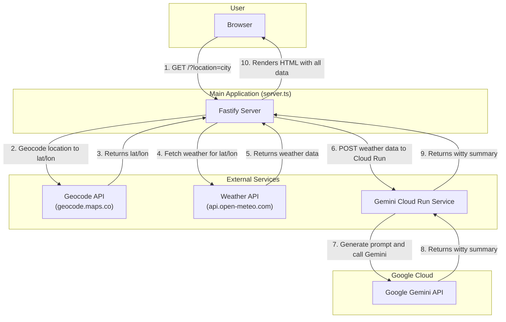
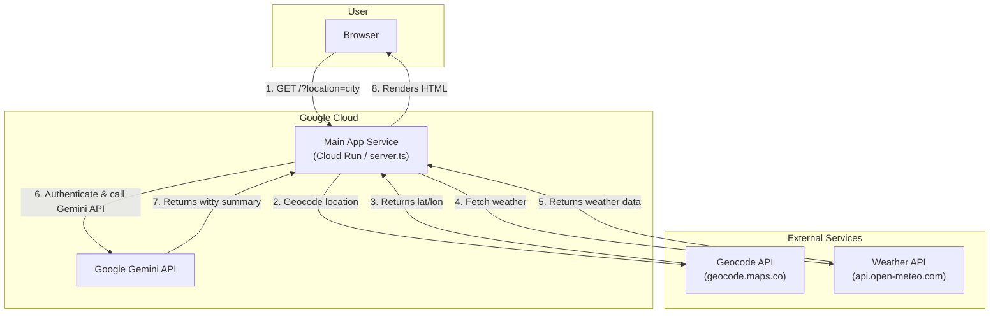
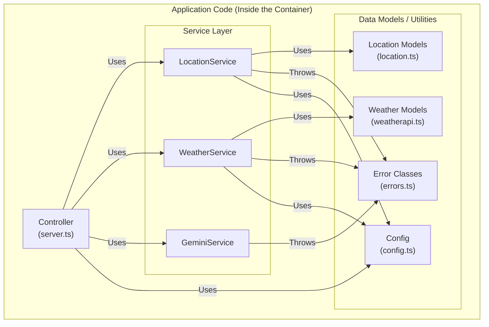
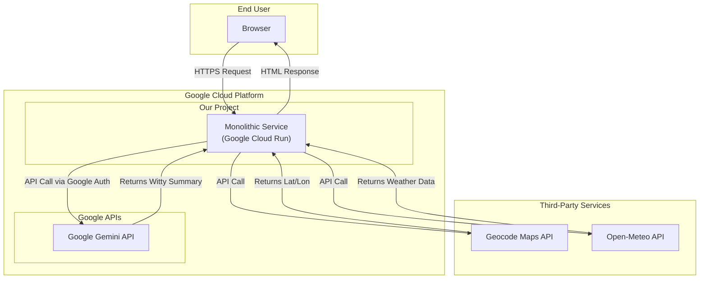

# Case Study: Architectural Refactoring of a Cloud-Native Web Application

## Executive Summary
This document outlines the strategic refactoring of a cloud-native web application. The project began as a proof-of-concept with a complex microservice architecture. Through a process of critical analysis, applying established software design patterns, and a rigorous testing discipline, I led the transformation of the application into a robust, maintainable, and performant monolithic service, ready for automated, production-grade deployment.

---

### The Initial Spark: Questioning the "As-Is" Architecture

My involvement began with a simple request: to understand the application's architecture. The initial diagrams revealed a system composed of two distinct microservices: a main application backend and a separate Gemini service for generating AI summaries.

While functional, I immediately questioned the validity of this approach. My architectural intuition suggested that for the scale and scope of this project, the added complexity of a microservice architecture was not providing value. It introduced network latency, operational overhead, and a deployment dependency between two services that were, in reality, tightly coupled. I concluded that the architecture was unnecessarily complicated and that a simpler, more direct approach would yield a better result.

### The Strategic Pivot: A Case for a Well-Structured Monolith

Based on this analysis, I proposed a significant architectural pivot: we would refactor the application into a single **monolithic service**. This decision was driven by first-principles of software design:
- **Reduce Complexity:** A single codebase, build process, and deployment target is inherently simpler to manage.
- **Improve Performance:** Eliminating the internal network call between services directly reduces request latency.
- **Lower Costs:** One service is cheaper to run and monitor than two.

The goal was to create a "to-be" architecture that was lean, efficient, and easier to reason about.

### The Execution: A Disciplined, Multi-Stage Refactoring

With a clear architectural goal, I executed a methodical refactoring process, applying senior engineering best practices at each stage.

**1. Service-Oriented Design & The Facade Pattern:**
The first step was to untangle the business logic from the web server. I designed and implemented a dedicated **service layer**, encapsulating all external API interactions (`LocationService`, `WeatherService`, `GeminiService`). These services act as **Facades**, providing a simple, clean interface to the application while hiding the complex machinery of authentication, network requests, and error handling.

**2. Dependency Injection for Testability:**
Crucially, the new services were designed to be testable. Instead of creating their own dependencies, dependencies like the HTTP client were **injected** into their constructors. This decoupling was the key that unlocked our ability to perform comprehensive unit testing.

**3. Test-Driven Cleanup & Verification:**
With a testable architecture in place, I developed a full suite of unit tests using **Jest** and **axios-mock-adapter**. This wasn't just about validation; the testing process itself acted as a quality gate, revealing dead code, unused dependencies, and subtle bugs in the implementation. This iterative cycle of testing and fixing was instrumental in achieving a clean, reliable codebase.

**4. The Final Software Architecture:**
The result of this process is a codebase with a clear, logical, and maintainable internal structure. It is a monolith, but it is not a "big ball of mud." It is a well-structured system with clear boundaries and responsibilities.

**5. Process Automation & Cleanup:**
The final touch was to professionalize the deployment process. I analyzed the existing manual PowerShell scripts and the `cloudbuild.yaml` file. I identified the automated Cloud Build pipeline as the superior, repeatable solution. I updated the Cloud Build configuration to match our new monolithic architecture, and decisively removed the now-obsolete manual scripts, ensuring a clean and unambiguous path to production.

### Conclusion: More Than Code, A Mindset

This project is a showcase of an engineering mindset that values clarity, simplicity, and robustness over unnecessary complexity. It demonstrates the ability to critically analyze an existing architecture, propose a bold but reasoned alternative, and execute that vision through disciplined, test-driven development and the application of established design patterns.

The final artifact is not just a working application; it is a clean, well-documented, fully-tested codebase with a professional, automated deployment pipeline—a testament to the craft of software engineering.

The final cloud architecture we deployed is as follows:

